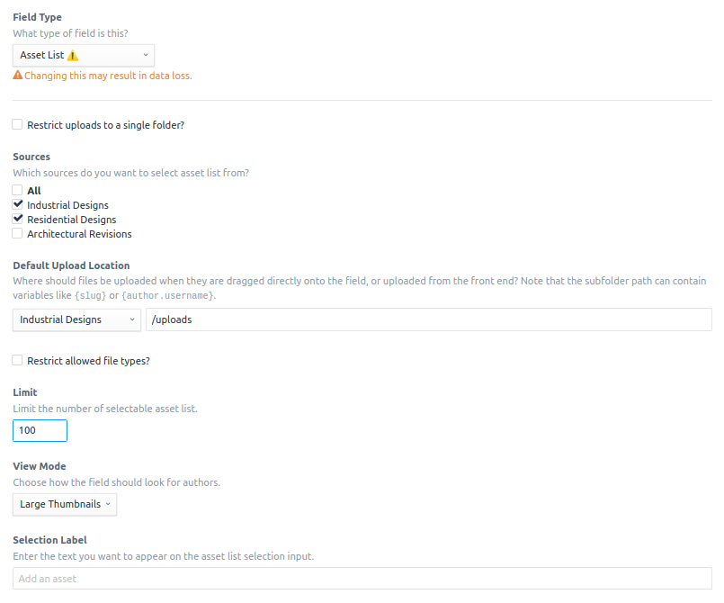

# Element List Field Type for Craft CMS
[](https://gitter.im/flipboxfactory/craft-element-lists?utm_source=badge&utm_medium=badge&utm_campaign=pr-badge&utm_content=badge)
[](LICENSE.md)
[](https://travis-ci.com/flipboxfactory/craft-element-lists)
[](https://scrutinizer-ci.com/g/flipboxfactory/craft-element-lists/code-structure)
[](https://scrutinizer-ci.com/g/flipboxfactory/craft-element-lists)
[](https://packagist.org/packages/flipboxfactory/craft-element-lists)

Element List introduces a table-based element relational field type; perfect for large or growing element relations.  


## New in Version 3
Element List field(s) now return a [Relationship Interface] (not the traditional [Element Query Interface]).  As a result, if your app manipulates relationships in a custom manner (php/plugins/modules) some changes are required.  Specifically, manipulating relations should use the `add`, `remove`, and `save` methods on the [Relationship Interface] (examples are below).

__Note: Accessing field data using the legacy [Element Query Interface] via TWIG is still supported; no code change are required.__

## Requirements
This plugin requires Craft CMS 3.2.x thru Craft 3.3.x.

## Installation
Choose one of the following ways to add [Element List] to your project:

1. Composer:

    Simply run the following command from your project root:

    ```
    composer require flipboxfactory/craft-element-lists
    ```

2. Craft CMS Plugin Store:

    Within your Craft CMS project admin panel, navigate to the '[Plugin Store]' and search for '[Element List]'. Installation is a button click away.


Once the plugin is included in your project, navigate to the Control Panel, go to Settings → Plugins and click the “Install” button for [Element List].

Additional information (including pricing) can be found in the [Plugin Store].


## Features
[Element List] brings the familiar element 'index' view to your fields.  Built for large relation sets, [Element List] provides content publishers a filterable, table based view to related elements.  [Element List] is as easy to configure as native relationships. 

Here are some of the features at a glance:
* Add/Remove relations in real time
* Handles large relational sets (hundreds/thousands)
* Sortable list view
* Searchable list view
* Developer friendly

### Templating *(version 1 & 2)*
Similar to [native relational fields](https://docs.craftcms.com/v3/relations.html), an [Element List] field returns an [Element Query Interface].  

Loop through field relations:
```twig
<ul>
    
        <li>{{ relatedElement.id }} - {{ relatedElement.someCustomField }}</li>
    
</ul>
```

### Templating *(version 3)*
An [Element List] field returns an [Relationship Interface] which is the primary interface for accessing and managing
relationships.  

Loop through field relations:
```twig
<ul>
    
        <li>{{ relatedElement.id }} - {{ relatedElement.someCustomField }}</li>
    
</ul>
```

The legacy query operations from version 1 & 2 (above) are still accessible (but discouraged).

### Collections *(new in Version 3)*
In version 3 you'll begin to work with a [Collection].  These are super handy classes
with various [methods](https://laravel.com/docs/5.8/collections#available-methods) to interact with your data.

### Eager Loading
Element Lists also supports eager-loading.  Simply follow the native [nested sets eager loading documentation](https://docs.craftcms.com/v3/dev/eager-loading-elements.html#eager-loading-nested-sets-of-elements).

### Developers
Native relationship fields are not developer friendly; we aim to fix that in version 3 by introducing the concept of a [Relationship Interface].   
Here are a few examples:

```php
// Add two new users to the list
Entry::findOne(['id' => 1])
    ->userListField
    ->add([
        'nate@flipboxdigital.com',
        'damien@flipboxdigital.com'
    ])
    ->save();
```

```php
// Remove one user and add another
Entry::findOne(['id' => 1])
    ->userListField
    ->remove('nate@flipboxdigital.com')
    ->add('damien@flipboxdigital.com')
    ->save();
```

```php
// Remove all users
Entry::findOne(['id' => 1])
    ->userListField
    ->clear()
    ->save();
```

In the above examples, we're saving the relationships immediately; however if you make
changes to your relationships and don't save, when the element is saved the relationship changes
will also be saved.

### Screenshots





## Credits
- [Flipbox Digital](https://github.com/flipbox)

[Element Query Interface]: https://docs.craftcms.com/v3/dev/element-queries/#executing-element-queries
[Plugin Store]: https://plugins.craftcms.com/element-lists
[Element List]: https://plugins.craftcms.com/element-lists
[Relationship Interface]: https://github.com/flipboxfactory/craft-element-lists/blob/develop/src/relationships/RelationshipInterface.php
[Collection]: https://laravel.com/docs/5.8/collections